<div align="center">


**面向 AI 聊天应用与 agent 的对话组织层 · The conversation organization layer for AI chat apps and agents**

_Doctor Chaos will see you now._

[](https://www.npmjs.com/package/@doctorchaos-ai/core)
[](https://github.com/doctorchaos-ai/doctor-chaos/actions/workflows/ci.yml)
[](./LICENSE)
[](https://github.com/doctorchaos-ai/doctor-chaos/actions)
[](./README.md)

**[🇨🇳 中文](#为什么做这件事)** · **[🇬🇧 English](#english)**

</div>

---

## 为什么做这件事

打开任何一个主流 AI 聊天工具,你都在做一件本不该你做的事:重命名对话、建文件夹、在侧边栏翻找上周三那个会话。

**每一个 AI 用户都被悄悄地塞了一份兼职——做自己聊天记录的文件管理员。**

这是设计上的失败,不是功能。所有 AI 产品都在逼用户先回答"你要聊哪件事",再让你开口——对话归属这件事本该是 AI 的责任,不是用户的。

Doctor Chaos 修复的就是让这种失败感觉起来"理所当然"的那一层。**用户只负责说话,Doctor Chaos 负责知道这句话该去哪。**

---

## 它做了什么

> **① 用户不用管对话归属**
>
> 新消息自动路由到对应的话题空间;零散的碎片会聚合、涌现成新的话题空间;长期不活跃的话题悄悄归档。全程不问用户"你想去哪个房间"。

> **② 医院式设计,不是 AI 智能分类器**
>
> 架构源于医院运作方式——前台分诊、全科留观、专科接诊。这套结构可以讲给产品经理、设计师、非技术团队听懂,不只是工程师的玩具。

> **③ 主流大模型一等公民,不挑厂商**
>
> 8 家厂商都是一等公民,一行 import 就能接。**海外**:OpenAI / Anthropic (Claude)。**国产**:DeepSeek / Kimi / 智谱 GLM / 通义千问 / MiniMax / 豆包。
>
> 这是目前国内开发者生态里,第一个把国产大模型**全部当成一等公民**的对话组织库。

---

## 怎么接入(2026 年的办法:交给 AI)

**场景一：你是在自建/修改 AI 应用的开发者**

把下面这段话复制给 Cursor / Claude Code / Kiro / Cline / Aider / Windsurf 等 AI 编辑器:

> 把 Doctor Chaos 集成到我当前的项目里。读 https://github.com/doctorchaos-ai/doctor-chaos/blob/main/LLMS.md,按里面的步骤修改我的代码。

AI 会自己读完 [LLMS.md](./LLMS.md),识别你的项目类型(OpenClaw / Koishi / Telegram bot / 自建 agent 等)和你已经在用的 LLM 厂商(从 `package.json`、`.env`、现有代码里自动看出来),装对应的 npm 包,改对你代码里需要改的那两处。

**场景二：你是 Hermes / OpenClaw / Claude Desktop 用户，不想写代码**

把下面这段话复制给你日常用的 agent（它有终端权限就行）：

> 把 Doctor Chaos 装进我当前这个 agent。读 https://github.com/doctorchaos-ai/doctor-chaos/blob/main/clients/python/INSTALL_VIA_AGENT.md ，按里面的步骤一步步执行，遇到环境不明就停下来问我。

agent 会自己把 daemon 跑起来、把 Python 插件装好、把 Hermes config 改对。你只需要回答它问的那几个环境问题。

整个过程你**不用写一行代码**,只需要确认 AI 的改动是否合理。

<details>
<summary><b>不用 AI 编辑器?手动接入也行,3 分钟搞定</b></summary>

<br/>

### 1. 装两个包

```bash
npm install @doctorchaos-ai/core @doctorchaos-ai/deepseek
# 换厂商只需要换包名:anthropic / kimi / zhipu / qwen / minimax / doubao / openai
```

### 2. 在你的 agent 代码里加几行

```typescript
import { Clinic } from '@doctorchaos-ai/core';
import { deepseek } from '@doctorchaos-ai/deepseek';

const clinic = new Clinic({
  llm: deepseek({ apiKey: process.env.DEEPSEEK_API_KEY! }),
});

// 在你收到用户消息的地方:
const result = await clinic.send({
  role: 'user',
  content: '帮我订下周去京都的机票',
});

if (result.destination === 'topicSpace') {
  console.log(`落入:${result.space.name}`);
}
```

详细集成指南见 [LLMS.md](./LLMS.md)——虽然是写给 AI 看的,但人读也没问题。

</details>

---

<div align="center">

下面的内容是给好奇背后原理的开发者看的。
如果你只想接入,上面已经够了。

</div>

---

## 三档路由

Doctor Chaos 能开箱即用,但准确率取决于你给它的"眼睛"。三档递进:

| 档位                           | 触发条件                                   | 准确率 |   延迟    |    成本     |
| ------------------------------ | ------------------------------------------ | :----: | :-------: | :---------: |
| **🟧 第三档 · LLM 路由**       | 传 `llm: ...`                              | 95-99% | 300-800ms | ~$0.001/条  |
| **🟨 第二档 · Embedding 路由** | 传 `embed: ...` 或 env 有 `OPENAI_API_KEY` | 90-95% | 100-300ms | ~$0.0001/条 |
| **⬜ 第一档 · 关键词匹配**     | 零配置                                     | 60-75% |   <10ms   |    免费     |

```mermaid
flowchart TD
    A[new Clinic&#40;&#41;] --> B{用户传了什么?}
    B -->|llm: xxx| C[第三档<br/>LLM 路由]
    B -->|embed: xxx| D[第二档<br/>Embedding 路由]
    B -->|什么都没传| E{env 有<br/>OPENAI_API_KEY?}
    E -->|有| D
    E -->|没有| F[第一档<br/>关键词匹配]
```



<details>
<summary><b>第一档 · 关键词匹配(零配置)</b></summary>

<br/>

字符串匹配用户消息和每个话题空间的 keywords。命中率高的胜出。

- ✅ 零依赖、零配置、离线可用、免费
- ❌ 60-75% 准确率,同义词、别称、跨语言全部失效

**适用**:本地开发、单元测试、POC demo。**生产不推荐**。

</details>

<details>
<summary><b>第二档 · Embedding 路由(自动嗅探 / 显式传入)</b></summary>

<br/>

把消息和 keywords 转成向量,算余弦相似度。

**触发**:`OPENAI_API_KEY` 在 env 里 → 自动升级;或显式 `embed: openaiEmbed({...})`。也支持 `OPENAI_BASE_URL` 指向 Azure / OpenRouter / LiteLLM 等兼容端点。

- ✅ 90-95% 准确率,同义词和语义相近自然匹配
- ✅ 100-300ms 延迟,~$0.0001/条
- ⚠️ 只能用有 embedding 接口的厂商(OpenAI 及兼容厂商)

**适用**:大多数生产用户的默认选择。

</details>

<details>
<summary><b>第三档 · LLM 路由(任何大模型都能接)</b></summary>

<br/>

构造 prompt 把消息 + 话题空间名字/keywords 丢给大模型,让它直接回答"应该进哪个空间"。

- ✅ 95-99% 准确率,能理解"上周那件事"的指代
- ✅ 支持所有 chat 模型,无 embedding 端点的厂商(Anthropic/DeepSeek 等)的唯一靠谱方案
- ⚠️ 300-800ms 延迟,~$0.001/条(比 embedding 贵 10 倍)

**适用**:对准确率要求最高的产品,或你用的 LLM 厂商不提供 embedding。

</details>

---

## 医院隐喻:内部长什么样

如果你要把 Doctor Chaos 集成进产品,这一节帮你理解它的状态机。

三个空间,一个接诊流程,一条硬规则:**病人不需要自己诊断。**

| 空间                        | 职责                                                                        |
| --------------------------- | --------------------------------------------------------------------------- |
| **前台 · Front Desk**       | 每条消息都先在这里分诊。决定它进入已有专科、新开一个专科,还是先留在全科。   |
| **全科 · General Practice** | 暂时还不是"一件事"的内容留在这里。不需要被归类,直到主题浮现后再打包成专科。 |
| **专科 · Topic Space**      | 长期运行、拥有完整上下文的话题空间。由系统自动创建,用户不用动手。           |

**关键动作**

- **分诊 · routing** — 每条新消息决定去哪
- **打包 · packaging** — 全科某个方向的碎片积累够密度,自动剪切打包成新专科
- **生命周期 · lifecycle** — 专科长期不活跃归档,用户再聊到相关内容自动复活

---

## 官方适配包

| 适配包                                                                                 | 厂商                                                         | 默认模型                                 |
| -------------------------------------------------------------------------------------- | ------------------------------------------------------------ | ---------------------------------------- |
| [`@doctorchaos-ai/openai`](https://www.npmjs.com/package/@doctorchaos-ai/openai)       | OpenAI / Azure / OpenRouter / LiteLLM / 任何 OpenAI 兼容端点 | `gpt-4o-mini` / `text-embedding-3-small` |
| [`@doctorchaos-ai/anthropic`](https://www.npmjs.com/package/@doctorchaos-ai/anthropic) | Anthropic Claude                                             | `claude-3-5-haiku-20241022`              |
| [`@doctorchaos-ai/deepseek`](https://www.npmjs.com/package/@doctorchaos-ai/deepseek)   | DeepSeek                                                     | `deepseek-chat`                          |
| [`@doctorchaos-ai/kimi`](https://www.npmjs.com/package/@doctorchaos-ai/kimi)           | Moonshot Kimi                                                | `moonshot-v1-8k`                         |
| [`@doctorchaos-ai/zhipu`](https://www.npmjs.com/package/@doctorchaos-ai/zhipu)         | 智谱 GLM                                                     | `glm-4-flash`                            |
| [`@doctorchaos-ai/qwen`](https://www.npmjs.com/package/@doctorchaos-ai/qwen)           | 通义千问(DashScope 兼容模式)                                 | `qwen-plus`                              |
| [`@doctorchaos-ai/minimax`](https://www.npmjs.com/package/@doctorchaos-ai/minimax)     | MiniMax                                                      | `MiniMax-Text-01`                        |
| [`@doctorchaos-ai/doubao`](https://www.npmjs.com/package/@doctorchaos-ai/doubao)       | 豆包(火山引擎 Ark)                                           | Ark endpoint id(自行创建)                |

> [!TIP]
> 没在这个列表里?用 core 自带的 `openAiCompatibleLLM` 一行代码接入任何 OpenAI 兼容端点——Groq、Together、自建代理都行。

---

## 在你的 stack 里是什么位置

| 库                                                     | 职责                       |
| ------------------------------------------------------ | -------------------------- |
| [LangChain](https://github.com/langchain-ai/langchain) | 把 LLM 连接到工具和数据    |
| [Mem0](https://github.com/mem0ai/mem0)                 | 让 AI 记住用户的事实和偏好 |
| **Doctor Chaos**                                       | **组织对话本身**           |

三者互补,不冲突。一个完整的 agent 可以同时使用三者。

---

## 项目状态

> [!NOTE]
> Doctor Chaos 目前处于 **alpha** 阶段。alpha 不是免责声明,是承诺——v0.1.0 范围内的公开 API 已经完备,但可能根据真实集成反馈在小版本之间调整。

**已经可用**

- 三档路由:关键词 / Embedding / LLM
- 8 个官方适配包,覆盖主流海外与国产大模型
- 路由 / 聚类 / 打包 / 生命周期 / 纠正学习
- 完整 TypeScript 类型、249 个单元测试、CI 覆盖 Node 18/20/22
- `LLMS.md` 集成说明(给 AI 编辑器看的)

**接下来**

- `@doctorchaos-ai/react` · 无 UI 的 React hooks
- `@doctorchaos-ai/openclaw` · OpenClaw 官方插件(用户零改动体验)
- `@doctorchaos-ai/sqlite` / `@doctorchaos-ai/indexeddb` · 存储适配器

---

## 社区

诊室小,人不多,但门是开的。

- 🧑‍⚕️ 作者 · [Dr. Chaos](https://x.com/Chaosxinglong)
- 💬 Issues 与 Discussions · **alpha 期间暂时关闭**以保持迭代速度,v0.1.0 时开放
- 🔗 [npm 组织 @doctorchaos-ai](https://www.npmjs.com/org/doctorchaos-ai)

<details>
<summary><b>设计起源</b></summary>

<br/>

Doctor Chaos 最早是一个 iOS 参考实现,不是为了发布,是为了搞清楚一件事:AI 聊天 UI 怎么才能摆脱无尽侧边栏。

Swift 原型从来不是最终产品。它的任务只有一个——在 TypeScript 移植之前,压力测试"路由 + 聚类 + 打包"这套模型能不能立得住。

项目之前叫 **cha0s**,npm 上还能看到 `@cha0s-ai/core`(已废弃,请使用 `@doctorchaos-ai/core`)。换名字这事拖了挺久,主要是当时还没想清楚医院隐喻——直到分诊台、全科、专科这三层结构跑通,才意识到这个项目其实在"接诊"。

</details>

---

<div align="center">

<a id="english"></a>

— 🇬🇧 English version · 英文版点开 —

</div>

<details>
<summary><b>Read the English README</b></summary>

<br/>

## Why this exists

Open any mainstream AI chat tool and you're quietly doing a job nobody signed you up for: renaming conversations, building folders, archaeology in the sidebar for last Tuesday's thread.

**Every AI user has been drafted as a filing clerk for their own chat history.**

That's a design failure, not a feature. Every AI product makes you answer "which conversation is this?" before it lets you speak — but conversation placement should be the AI's job, not the user's.

Doctor Chaos fixes the layer that makes this failure feel inevitable. **The user just talks. Doctor Chaos figures out where the message belongs.**

## What it does

> **① Users never manage conversation placement**
>
> New messages route themselves into the right topic space. Loose fragments cluster and promote themselves into brand-new spaces. Dormant threads fade out of the way.

> **② Hospital-shaped, not another "AI smart classifier"**
>
> The architecture mirrors how a hospital works — triage at the front desk, watch-and-wait in general practice, specialty rooms for long-running topics. Legible to PMs, designers, and non-technical teammates, not just engineers.

> **③ Every major LLM is a first-class citizen**
>
> Eight providers, all first-class: OpenAI / Anthropic (Claude) / DeepSeek / Kimi / Zhipu GLM / Qwen / MiniMax / Doubao. The first conversation-organization library that treats Chinese LLMs as first-class citizens alongside the Western stack.

## How to integrate (the 2026 way: hand it off to AI)

**Copy this prompt into Cursor / Claude Code / Kiro / Cline / Aider / Windsurf / any AI editor:**

> Integrate Doctor Chaos into my current project. Read https://github.com/doctorchaos-ai/doctor-chaos/blob/main/LLMS.md and follow its integration procedure to modify my code.

The AI reads [LLMS.md](./LLMS.md), detects your project type (OpenClaw / Koishi / Telegram bot / custom agent) and the LLM provider you're already using (from `package.json`, `.env`, and existing code), installs the right packages, and wires them into your message handler. You write no code — you only approve the AI's diff.

<details>
<summary><b>Prefer manual integration? 3 minutes of copy-paste</b></summary>

<br/>

```bash
npm install @doctorchaos-ai/core @doctorchaos-ai/deepseek
# swap deepseek for: anthropic / kimi / zhipu / qwen / minimax / doubao / openai
```

```typescript
import { Clinic } from '@doctorchaos-ai/core';
import { deepseek } from '@doctorchaos-ai/deepseek';

const clinic = new Clinic({
  llm: deepseek({ apiKey: process.env.DEEPSEEK_API_KEY! }),
});

const result = await clinic.send({
  role: 'user',
  content: 'Book me a flight to Kyoto next week.',
});
```

Full integration guide: [LLMS.md](./LLMS.md) — written for AI editors, but humans can read it too.

</details>

## Three-tier routing

| Tier                      | Trigger                                 | Accuracy |  Latency  |     Cost     |
| ------------------------- | --------------------------------------- | :------: | :-------: | :----------: |
| **🟧 Tier 3 · LLM**       | `llm: ...`                              |  95-99%  | 300-800ms | ~$0.001/msg  |
| **🟨 Tier 2 · Embedding** | `embed: ...` or `OPENAI_API_KEY` in env |  90-95%  | 100-300ms | ~$0.0001/msg |
| **⬜ Tier 1 · Keyword**   | zero config                             |  60-75%  |   <10ms   |     free     |

```mermaid
flowchart TD
    A[new Clinic&#40;&#41;] --> B{What did you pass?}
    B -->|llm: xxx| C[Tier 3<br/>LLM routing]
    B -->|embed: xxx| D[Tier 2<br/>Embedding routing]
    B -->|nothing| E{OPENAI_API_KEY<br/>in env?}
    E -->|yes| D
    E -->|no| F[Tier 1<br/>Keyword matching]
```



## The hospital metaphor

Three spaces, one admission process, one strict rule: **patients are not asked to self-diagnose.**

| Space                       | Role                                                                                                                         |
| --------------------------- | ---------------------------------------------------------------------------------------------------------------------------- |
| **Front Desk**              | Every message is triaged here first. Routes to existing specialty, new specialty, or general practice.                       |
| **General Practice**        | Anything not yet a "thing" waits here without pressure to be labelled. When a theme emerges, it's packaged into a specialty. |
| **Topic Space (Specialty)** | A long-running, focused conversation with its full context. Created by the clinic, not by the user.                          |

## Official adapters

| Adapter                                                                                | Provider                                                               | Default model                            |
| -------------------------------------------------------------------------------------- | ---------------------------------------------------------------------- | ---------------------------------------- |
| [`@doctorchaos-ai/openai`](https://www.npmjs.com/package/@doctorchaos-ai/openai)       | OpenAI / Azure / OpenRouter / LiteLLM / any OpenAI-compatible endpoint | `gpt-4o-mini` / `text-embedding-3-small` |
| [`@doctorchaos-ai/anthropic`](https://www.npmjs.com/package/@doctorchaos-ai/anthropic) | Anthropic Claude                                                       | `claude-3-5-haiku-20241022`              |
| [`@doctorchaos-ai/deepseek`](https://www.npmjs.com/package/@doctorchaos-ai/deepseek)   | DeepSeek                                                               | `deepseek-chat`                          |
| [`@doctorchaos-ai/kimi`](https://www.npmjs.com/package/@doctorchaos-ai/kimi)           | Moonshot Kimi                                                          | `moonshot-v1-8k`                         |
| [`@doctorchaos-ai/zhipu`](https://www.npmjs.com/package/@doctorchaos-ai/zhipu)         | Zhipu GLM                                                              | `glm-4-flash`                            |
| [`@doctorchaos-ai/qwen`](https://www.npmjs.com/package/@doctorchaos-ai/qwen)           | Alibaba Qwen (DashScope compatible mode)                               | `qwen-plus`                              |
| [`@doctorchaos-ai/minimax`](https://www.npmjs.com/package/@doctorchaos-ai/minimax)     | MiniMax                                                                | `MiniMax-Text-01`                        |
| [`@doctorchaos-ai/doubao`](https://www.npmjs.com/package/@doctorchaos-ai/doubao)       | Doubao (Volcengine Ark)                                                | Ark endpoint id                          |

## Where it fits

| Library                                                | Scope                                |
| ------------------------------------------------------ | ------------------------------------ |
| [LangChain](https://github.com/langchain-ai/langchain) | Connect LLMs to tools and data       |
| [Mem0](https://github.com/mem0ai/mem0)                 | Remember user facts and preferences  |
| **Doctor Chaos**                                       | **Organize the conversation itself** |

Complementary, not competitive. A complete agent can use all three.

## Project status

> [!NOTE]
> Doctor Chaos is in **alpha**. "Alpha" isn't a disclaimer — it's a commitment. The public API is feature-complete for v0.1.0 scope but may shift between minor versions based on real-world integration feedback.

Works today: three-tier routing, eight official adapters, routing / clustering / packaging / lifecycle / correction learning, 249 unit tests, CI across Node 18/20/22, and `LLMS.md` for AI-editor integration.

What's next: `@doctorchaos-ai/react`, `@doctorchaos-ai/openclaw` (zero-code user experience), storage adapters for SQLite and IndexedDB.

## Community

The clinic is small, the waiting room is quiet, but the door is open.

- 🧑‍⚕️ Author · [Dr. Chaos](https://x.com/Chaosxinglong)
- 💬 Issues and Discussions · temporarily disabled during alpha, both open at v0.1.0
- 🔗 [@doctorchaos-ai on npm](https://www.npmjs.com/org/doctorchaos-ai)

## Design origin

Doctor Chaos started as an iOS reference implementation — not for release, but to answer a single question: how should AI chat UIs evolve beyond the sidebar-of-everything?

The Swift prototype was never the product. Its only job was stress-testing the "routing + clustering + packaging" model before the TypeScript port.

The project was previously known as **cha0s** (`@cha0s-ai/core`, deprecated). The renaming took a while — only when front desk, general practice, and specialty crystallized as three distinct layers did it become clear the project was really about triage.

</details>

---

<div align="center">

[MIT](./LICENSE) © [Chaos](https://github.com/chaos-xxl)

</div>
